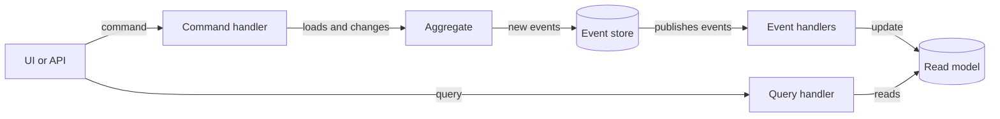

# Concepts

This page explains the two ideas CQRSlite is built on, CQRS and event sourcing, and how the framework's types map onto them. You don't need to know either idea beforehand.

## CQRS

CQRS stands for Command Query Responsibility Segregation. The idea is to split your application into two sides:

- The **write side** changes state. It receives *commands*, such as "check in five items", checks that they are allowed, and records what happened.
- The **read side** answers questions. It receives *queries*, such as "how many items are in stock?", and returns data shaped for whoever asked.

In a typical application one model does both jobs, and it ends up being a compromise: the shape that is good for enforcing business rules is rarely the shape a screen or a report wants. With CQRS each side gets the model that suits it. The write side can focus on rules and the read side on fast, simple reads, often from data that is denormalized ahead of time so a query is little more than a lookup.

The cost is that you now have two models to keep in step. That is where events come in.

## Event sourcing

Most applications store the current state: a row that says an item has 3 in stock. Event sourcing stores what happened instead:

1. Item created
2. 5 items checked in
3. 2 items removed

The current state is whatever you get by replaying those events in order. The events are the source of truth, and they are never changed or deleted, only added to.

This gives you a full history for free: you can always answer "how did it get like this?". It also means you can build new views of the data later by replaying old events, without having planned for them in advance.

## Why they go together

CQRS needs a way to keep the read side up to date with the write side, and event sourcing produces exactly that: a stream of everything that changed. The write side stores events. The read side listens to those events and updates its own data, called *read models* or *projections*, in whatever shape its queries need.

So a change flows through the system like this:

## The building blocks

These are the pieces you work with in CQRSlite, in the order a change passes through them.

**Commands** are requests to change something, named in the imperative: `CheckInItemsToInventory`, `RenameInventoryItem`. A command implements `ICommand` and can be refused, for example when it would break a business rule.

**Command handlers** receive a command, load the aggregate it is about, call a method on it and save it. Each command has exactly one handler.

**Aggregates** are the objects that enforce your business rules. An aggregate is a cluster of state that has to stay consistent as a whole, such as one inventory item. It inherits from `AggregateRoot` and is identified by a `Guid`. When asked to do something, it checks its rules and, if they hold, records one or more events. It never changes its state directly. Instead it applies the events it records, and the same code applies them again when the aggregate is loaded later.

**Events** are facts about something that happened, named in the past tense: `ItemsCheckedInToInventory`. An event implements `IEvent`, which has the id of the aggregate it belongs to, a version (its position in that aggregate's history, starting at 1) and a timestamp. Events are the contract between the write side and the read side.

**The session** (`ISession`) is a unit of work. A command handler gets aggregates through it and calls `Commit` when done, which saves every aggregate the session has handed out.

**The repository** (`IRepository`) loads an aggregate by replaying its events from the event store, and saves it by appending its new events. You rarely call it directly; the session does.

**The event store** (`IEventStore`) is where events are kept. CQRSlite defines the interface and you provide the implementation for your database, because that is the part that depends most on your system. After storing events it publishes them so the read side can react.

**Event handlers** receive published events and update read models. An event can have any number of handlers, or none.

**Queries and query handlers** are the read side's counterpart to commands. A query implements `IQuery<TResult>` and has exactly one handler, which returns the result from a read model.

**The router** (`Router`) delivers commands, events and queries to their handlers. `RouteRegistrar` finds your handlers by scanning assemblies, so you don't register each one by hand.

## Versions and concurrency

Every aggregate has a version: the number of events in its history. Versions are how CQRSlite stops two people from overwriting each other's changes.

Say two users open the same item, which is at version 4. Both submit a change, and each command carries the version that user saw. The first change is saved as event 5. When the second is saved, the repository finds that the item is no longer at version 4 and throws a `ConcurrencyException`, instead of silently applying a change that was decided on outdated information. This is called optimistic concurrency: nothing is locked, but conflicting writes are detected.

The event store has the last word here. It must refuse to store an event whose version already exists for that aggregate, because two saves that run at the same moment can both pass the repository's check. The [event store guide](guides/event-store.md) explains how.

## Eventual consistency

The read side is updated *after* the write side, from published events. In between, a query can return data that doesn't include the latest change yet. How long that window lasts depends on how events are delivered: in the sample it is effectively zero because events are handled before the request returns, while in a system that delivers events through a message queue it can be noticeable.

This is usually fine, and it is the trade that makes the read side simple and fast, but it is something to design for. For example, after a user submits a change, show them the result of their own command rather than re-querying straight away. [Taking it to production](tutorial/7-production.md) has more on this.

## When to use it

CQRS and event sourcing pay off when the history of changes matters, when business rules are rich enough that a model built just for enforcing them helps, or when reads and writes have very different needs. They add moving parts, so for simple CRUD screens a conventional design is usually the better choice. You can also use them for one part of a system and not the rest.

Next: [the tutorial](tutorial/1-overview.md).
